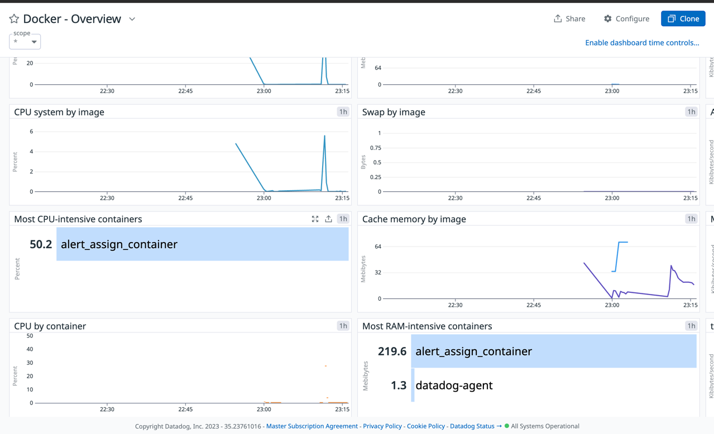

# Observabilidade

Como a aplicação teve deploy por meio de containers, também utilizamos deste recurso no datadog.

Uma versão gratuita de 10 dias que tem um agente rodando em um container na mesma maquina faz o trabalho de monitoramento de logs e métricas.

Não foi possivel compartilhar o dash, mas segue print do mesmo:

[voltar](README.MD)